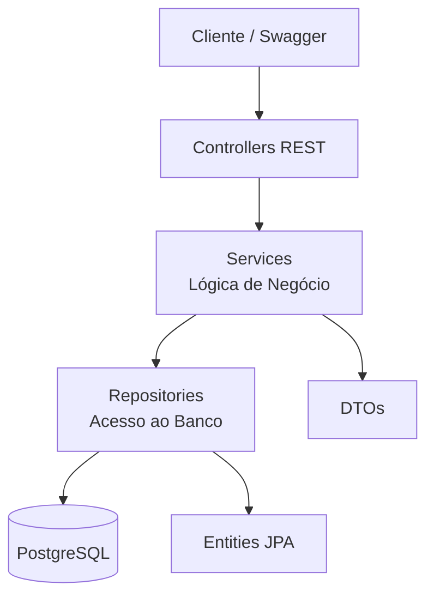

# 🏆 Church League Championship — Backend (Java + Spring Boot)

Sistema completo para gerenciamento de campeonatos amadores, incluindo torneios, partidas, gols, artilheiros, classificação e regras configuráveis.  
Desenvolvido em Java 17 + Spring Boot 3.5 com PostgreSQL e Docker.


## 📑 Sumário

1. [Visão Geral](#-visão-geral)
2. [Arquitetura](#-arquitetura)
3. [Tecnologias Utilizadas](#-tecnologias-utilizadas)
4. [Funcionalidades](#-funcionalidades)
5. [Estrutura do Projeto](#-estrutura-do-projeto)
6. [Modelagem do Banco](#-modelagem-do-banco)
7. [Instalação e Execução](#-instalação-e-execução)
8. [Documentação da API](#-documentação-da-api)
9. [Seeds de Desenvolvimento](#-seeds-de-desenvolvimento)
10. [Principais Endpoints](#-principais-endpoints)
11. [Fluxos Internos](#-fluxos-internos)
12. [Roadmap](#-roadmap)
13. [Autor](#-autor)

## 🔍 Visão Geral

O **Church League Championship** é um sistema completo para organização de campeonatos amadores.  
Ele permite cadastrar times, jogadores, torneios, gerar partidas automaticamente, registrar gols e acompanhar classificações em tempo real.

O objetivo é oferecer uma ferramenta simples, rápida e acessível para administrar ligas locais — incluindo torneios de igreja, bairros e comunidades — com regras configuráveis e suporte para múltiplas competições simultâneas.

Este backend fornece toda a lógica central do campeonato, totalmente integrada ao PostgreSQL e ao Docker, pronto para produção.

## 🏗️ Arquitetura do Sistema

O projeto segue uma arquitetura limpa e organizada em camadas, garantindo manutenção simples, separação de responsabilidades e evolução segura do código.

### 🔄 Fluxo Geral da Aplicação



src/main/java/com/churchleague/championship
│
├── controller     # Endpoints REST
├── service        # Regras de negócio
├── repository     # Interfaces JPA
├── dto            # Objetos de transferência
└── model          # Entidades


## 🛠️ Tecnologias Utilizadas

O sistema foi construído utilizando um conjunto moderno de tecnologias que garantem desempenho, estabilidade e fácil manutenção.

| Tecnologia           | Função |
|----------------------|--------|
| **Java 17**          | Linguagem principal da aplicação |
| **Spring Boot 3.5**  | Framework para criação do backend REST |
| **Spring Web**       | Exposição de endpoints HTTP |
| **Spring Data JPA**  | Integração com ORM e acesso ao banco |
| **Hibernate**        | Provider JPA utilizado pelo Spring |
| **PostgreSQL 16**    | Banco de dados relacional principal |
| **Docker**           | Containerização do banco para isolamento |
| **Gradle**           | Gerenciador de build |
| **H2 Database**      | Banco em memória opcional para desenvolvimento |
| **Swagger / OpenAPI**| Documentação automática das APIs |
| **DevTools**         | Reload automático durante o desenvolvimento |


## 🧱 Estrutura do Projeto

A aplicação segue uma arquitetura limpa, organizada por responsabilidades e alinhada com as boas práticas do Spring Boot.

src/main/java/com/churchleague/championship
│
├── controller # Endpoints REST (camada de entrada)
├── service # Lógica de negócio
├── repository # Interfaces JPA (acesso ao banco)
├── dto # Objetos de transferência de dados
└── model # Entidades JPA (mapeamento do banco)

**Descrição das pastas:**

- **controller** → Recebe requisições HTTP e chama os serviços  
- **service** → Implementa regras do campeonato, WO, classificação, geração de partidas  
- **repository** → Conversa com o PostgreSQL via Spring Data  
- **dto** → Padroniza o envio e recebimento de dados nas APIs  
- **model** → Estruturas principais: `Team`, `Player`, `Tournament`, `Match`, `GoalEvent`  

## 🗄️ Modelagem do Banco de Dados

O banco segue um modelo relacional simples, otimizado para campeonatos de futebol com partidas, artilharia e inscrição de times.

### 📌 Diagrama ER (Entity Relationship)

```mermaid
erDiagram
    TEAM ||--o{ PLAYER : possui
    TOURNAMENT ||--o{ MATCH : possui
    MATCH ||--o{ GOAL_EVENT : possui
    TOURNAMENT }o--o{ TEAM : participa
🧩 Tabelas Principais
TEAM
id (PK)

name

sigla

captain

phone

notes

status

PLAYER
id (PK)

name

goals

team_id (FK → TEAM)

TOURNAMENT
id (PK)

name

type

has_return

points_win

points_draw

points_loss

wo_home_goals

wo_away_goals

default_venue

MATCH
id (PK)

round_number

home_team_id (FK → TEAM)

away_team_id (FK → TEAM)

home_goals

away_goals

match_date

location

status

tournament_id (FK → TOURNAMENT)

GOAL_EVENT
id (PK)

match_id (FK → MATCH)

player_id (FK → PLAYER)

goal_minute
```
## 🚀 Instalação e Execução

Siga os passos abaixo para rodar o *Church League Championship* localmente.

---

### 1️⃣ Clonar o projeto

```bash
git clone https://github.com/seuusuario/championship.git
cd championship
```
2️⃣ Subir o PostgreSQL via Docker

O banco já está configurado no arquivo docker-compose.yml.

docker compose up -d


Banco ficará disponível em:

Host: localhost

Porta: 5432

Database: championship

Usuário: postgres

Senha: postgres

3️⃣ Rodar o back-end

Ativar o profile do PostgreSQL:

./gradlew bootRun --args='--spring.profiles.active=postgres'


Ou, se quiser compilar:

./gradlew build
java -jar build/libs/championship-0.0.1-SNAPSHOT.jar --spring.profiles.active=postgres

4️⃣ Acessar a API

Após iniciar, a aplicação estará em:

👉 http://localhost:8080

E o Swagger em:

👉 http://localhost:8080/swagger-ui.html

👉 http://localhost:8080/v3/api-docs

## 📚 Documentação da API

Toda a API do **Church League Championship** é documentada automaticamente via **Swagger / OpenAPI**, usando a biblioteca `springdoc-openapi`.

Com a aplicação rodando, você pode acessar:

- **Swagger UI (interface gráfica):**  
  👉 `http://localhost:8080/swagger-ui.html`

- **Documento OpenAPI em JSON:**  
  👉 `http://localhost:8080/v3/api-docs`

Através do Swagger é possível:

- Explorar todos os endpoints disponíveis  
- Visualizar os modelos de requisição e resposta  
- Testar chamadas diretamente pelo navegador (sem Postman)


